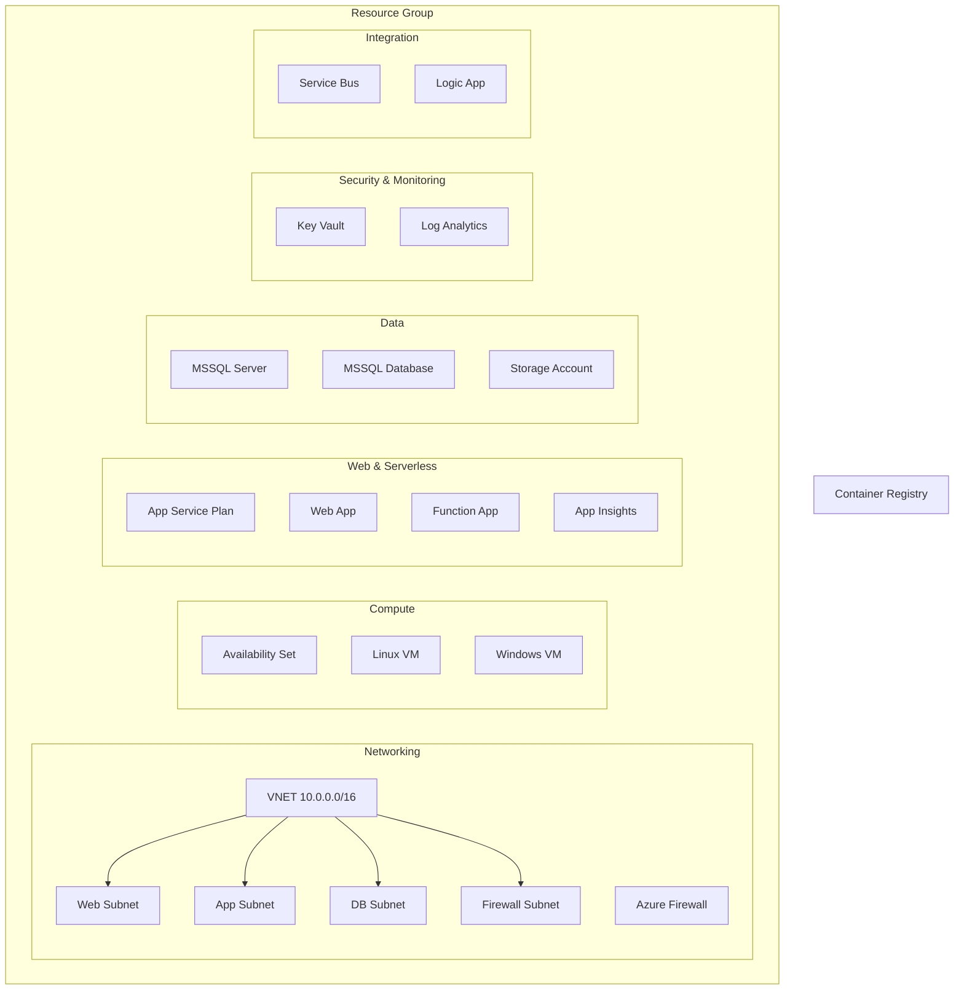

# tf-azure: Enterprise-Grade Azure Terraform Templates

A comprehensive, modular, and highly available Terraform template repository for provisioning Microsoft Azure infrastructure. Designed for scalability, security, and professional portfolio demonstration.

## 🚀 Key Features
- **Modular Architecture:** Reusable modules for Networking, Compute, Storage, Databases, Security, and Integration.
- **High Availability:** Built-in support for Availability Sets, GRS/ZRS storage, and resilient service plans.
- **Security First:** Integration with Azure Key Vault, Managed Identities, and Azure Firewall.
- **Container Ready:** Provisioning for **Azure Container Registry (ACR)** for modern workloads.
- **CI/CD Integrated:** Production-ready **GitHub Actions** workflow for automated Terragrunt orchestration.
- **Environment Management:** Clear separation between `dev` and `prod` environments.
- **Automation Ready:** Standardized naming conventions, clean parameterization, and **Terragrunt** orchestration for DRY, multi-environment deployments.

## 🏗️ Architecture Overview
The repository follows a hub-and-spoke inspired modular structure orchestrated by **Terragrunt**:



## 📂 Project Structure
```text
tf-azure/
├── modules/                  # Granular Resource Modules
│   ├── networking/           # {vnet, firewall}
│   ├── compute/              # {linux_vm, windows_vm, availability_set}
│   ├── database/             # {mssql_server, mssql_database}
│   ├── container_registry/   # {acr}
│   ├── security/             # {key_vault}
│   ├── storage/              # {storage_account}
│   ├── monitoring/           # {log_analytics}
│   ├── integration/          # {service_bus, logic_app}
│   └── web/                  # {app_service_plan, web_app, function_app, app_insights}
├── environments/             # Terragrunt Orchestration
│   ├── terragrunt.hcl        # Root config (DRY providers/state)
│   ├── dev/                  # Development Environment
│   └── prod/                 # Production Environment
├── scripts/                  # Automation Scripts
│   └── bootstrap-state.sh    # State backend provisioning
├── .github/workflows/        # CI/CD (GitHub Actions)
└── .gitignore                # Terraform/Terragrunt ignores
```

## 🛠️ Getting Started
1. **Clone the repository:**
   ```bash
   git clone https://github.com/shreyansh-sawarn/tf-azure.git
   cd tf-azure
   ```
2. **Configure your environment:**
   Update `environments/dev/env.hcl` with your project details.
3. **Initialize and Plan (All Components):**
   ```bash
   cd environments/dev
   terragrunt run-all plan
   ```

## 📝 Portfolio Note
- **Credential Management:** This repository uses placeholders for sensitive information (IDs, Secrets) to ensure portability and safe public display. In a real production environment, these should be managed via Key Vault or CI/CD secrets.
- **Advanced Orchestration:** We use **Terragrunt** to showcase advanced IaC orchestration patterns, including remote state management, dependency injection, and DRY configuration management.

---
*Developed as a professional showcase of Infrastructure as Code (IaC) best practices on Azure.*

Made with ❤️ by Shreyansh. Drop a ⭐ if you like it.