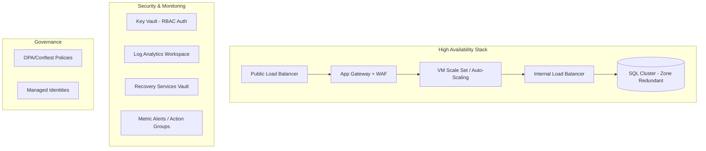
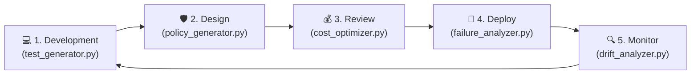
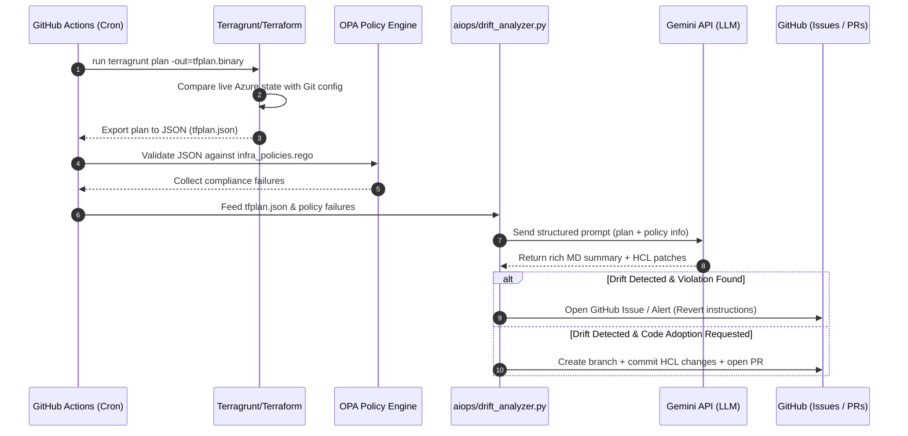
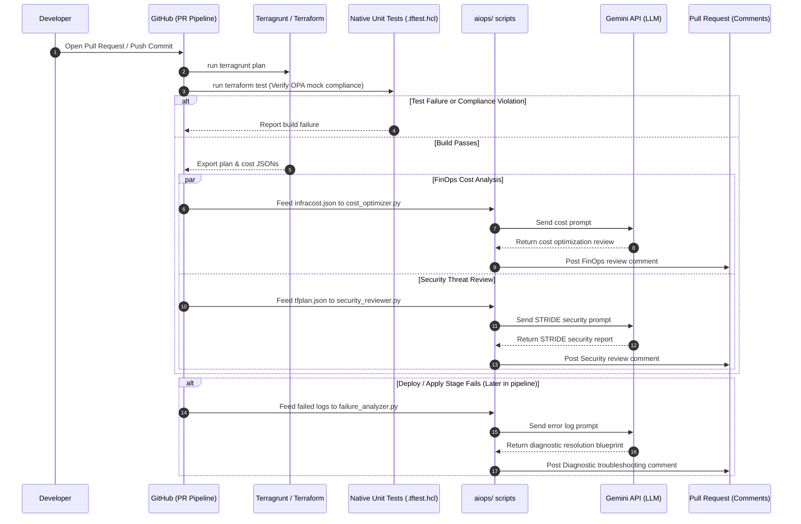

# tf-azure: Enterprise-Grade Azure Infrastructure Architecture

[](https://github.com/shreyansh-sawarn/tf-azure/actions/workflows/terragrunt.yml)
[](https://azure.microsoft.com/)
[](https://opentofu.org/)
[](https://www.terraform.io/)
[](https://opensource.org/licenses/MIT)
[](https://github.com/shreyansh-sawarn/tf-azure/commits/main)
[](https://github.com/shreyansh-sawarn/tf-azure)

A comprehensive, production-ready Azure infrastructure template repository. This project demonstrates high-level cloud architecture, implementing **Security by Design**, **Disaster Recovery**, and **Proactive Observability** using **Terragrunt** and **Terraform/OpenTofu**.

## 🚀 Key Features

- **🏗️ Grouped Stacks Architecture:** Optimized Terragrunt structure that groups related resources into logical services (Foundation, Networking, Compute, Data, etc.) for better operational manageability.
- **🛡️ Advanced Security & Governance:** 
  - **Policy-as-Code:** 8+ production-grade **OPA (Open Policy Agent)** rules enforcing TLS 1.2, private-only storage, and mandatory tagging.
  - **Secretless Auth:** Sophisticated IAM patterns using **User-Assigned Managed Identities** and Granular RBAC.
  - **Layer 7 Protection:** **Application Gateway with WAF (OWASP)** and **Azure Firewall** integrated via forced tunneling (UDR).
- **📈 High Availability & Elasticity:** 
  - **Kubernetes (AKS):** Managed **Azure Kubernetes Service** with **Azure CNI**, **Workload Identity**, and **Auto-Scaling** node pools.
  - **Auto-Scaling:** Virtual Machine Scale Sets (VMSS) with CPU-based scaling.
  - **Load Balancing:** Tiered Public and Internal Load Balancers for service resiliency.
  - **Redundancy:** Cross-region GRS storage and Zone-Redundant SQL databases.
- **🔄 Disaster Recovery:** 
  - **Recovery Services Vault:** Automated VM backup policies and soft-delete protection.
  - **Database PITR:** Point-in-time recovery enabled with up to 35-day retention.
- **🧪 Robust Validation:** 
  - **Offline Unit Testing:** Automated **Terraform Native Testing** (`.tftest.hcl`) utilizing **Mock Providers** for CI/CD validation without Azure credentials.
- **🤖 Unified AIOps Lifecycle Suite:** An offline-capable AI operations suite leveraging Gemini 2.5 to assist in all IaC phases: OPA policy generation (Design), STRIDE threat modeling (Security Review), FinOps cost optimization (Review), deployment troubleshooting (Debugging), and automated test-suite generation (Development).
- **🔓 Open Source Friendly:** 100% compatible with **OpenTofu 1.6+** and Terraform 1.5+, ensuring no vendor lock-in.


## 🏗️ Architecture Overview

The repository follows a service-oriented hub-and-spoke inspired structure orchestrated by **Terragrunt**:



### 🤖 Closed-Loop AIOps Lifecycle

Traditional IaC is static—but this repository integrates a **closed-loop AI Operations Lifecycle** that assists engineers across all phases of the development and operations cycle:



#### Scheduled Auditing & Auto-Remediation Flow

The repository features an automated AI operations agent running in GitHub Actions:

<details>
<summary>📋 Click to expand Scheduled Auditing Sequence Diagram</summary>



</details>

#### Pull Request (PR) Code Review & Security Gate Flow
During standard developer pull requests, the automated CI/CD pipeline triggers test verification, cost analysis, and security reviews:

<details>
<summary>📋 Click to expand PR Verification & Review Sequence Diagram</summary>



</details>


## 📂 Project Structure

```text
tf-azure/
├── modules/                  # Granular, reusable infrastructure modules
│   ├── networking/           # {vnet, firewall, lb, app_gateway, peering, route_table}
│   ├── compute/              # {vmss, linux_vm, windows_vm}
│   ├── database/             # {mssql_server, mssql_database}
│   └── security/             # {key_vault, rsv, identities, rbac}
├── aiops/                    # Unified AI Operations Lifecycle Suite
│   ├── mock_data/            # Mock plans, logs, cost and variable inputs
│   ├── expected_reports/     # Pre-cached offline fallbacks for GHA and CLI demos
│   ├── drift_analyzer.py     # Plan diff & compliance auditor
│   ├── cost_optimizer.py     # FinOps budget analyzer
│   ├── failure_analyzer.py   # Deployment log troubleshooter
│   ├── policy_generator.py   # Natural language to OPA policy translator
│   ├── security_reviewer.py  # STRIDE security reviewer
│   ├── copilot.py            # Conversational repository copilot CLI
│   └── test_generator.py     # Automated HCL unit test case generator
├── environments/             # Terragrunt Grouped Stacks
│   ├── dev/                  # Cost-optimized Development environment
│   └── prod/                 # High-performance, HA Production environment
├── policy/                   # OPA/Rego Infrastructure Policies
├── docs/                     # Comprehensive Architectural Documentation
└── .github/workflows/        # CI/CD (Lint, Test, Policy, Scan)
```

## 📖 Detailed Documentation

To make this project as reviewer-friendly as possible, I've created specialized guides for different architectural and operational pillars:

- **🔐 [State Management Strategy](./docs/state-management.md)**: Deep dive into remote state, locking, and disaster recovery.
- **💰 [Cloud Cost Estimation](./docs/cost-estimation.md)**: How we use Infracost to shift-left cost visibility.
- **🔄 [GitOps & Workflow](./docs/gitops-workflow.md)**: Details on the PR lifecycle and environment promotion.
- **🛠️ [Troubleshooting Guide](./docs/troubleshooting.md)**: Solutions for common IaC operational issues.
- **🤖 [AI Operations & Drift Auditing](./docs/ai-ops.md)**: Deep dive into scheduled drift monitoring, Gemini API audits, OPA rule mappings, and automated PR remediations.
- **❓ [Frequently Asked Questions](./docs/faq.md)**: Rationale behind tool choices and architectural patterns.

## 🌍 Environment Differentiation

| Feature | Development (Dev) | Production (Prod) |
|---------|-------------------|-------------------|
| **Networking** | 10.0.0.0/16 | 10.1.0.0/16 |
| **Firewall** | Standard | Premium (IDPS/TLS) |
| **SQL DB** | Basic | S0 (Zone Redundant) |
| **Storage** | LRS | GRS (Geo-Redundant) |
| **Retention** | 30 Days | 90 Days (Audit Ready) |
| **VM Sizing** | Burstable (B-series) | General Purpose (D/DS-series) |

## 🛠️ Quick Start

1. **Clone & Explore:**
   ```bash
   git clone https://github.com/shreyansh-sawarn/tf-azure.git
   cd tf-azure
   ```
2. **Run Tests (No Azure login required):**
   ```bash
   # CI/CD automatically runs these for every module
   terraform -chdir=modules/compute/vmss test
   ```
3. **Plan with Terragrunt:**
   ```bash
   cd environments/dev
   terragrunt run-all plan
   ```
4. **Run the AIOps Suite Demo (No Azure login or API key required):**
   ```bash
   # Audit drifts, OPA policy compliance, and FinOps costs:
   python aiops/drift_analyzer.py --demo
   python aiops/cost_optimizer.py --demo
   python aiops/security_reviewer.py --demo
   python aiops/test_generator.py --scan-modules --demo
   ```

---
*Developed as a professional showcase of Infrastructure as Code (IaC) best practices. Open to collaboration and feedback.*

Made with ❤️ by Shreyansh.
