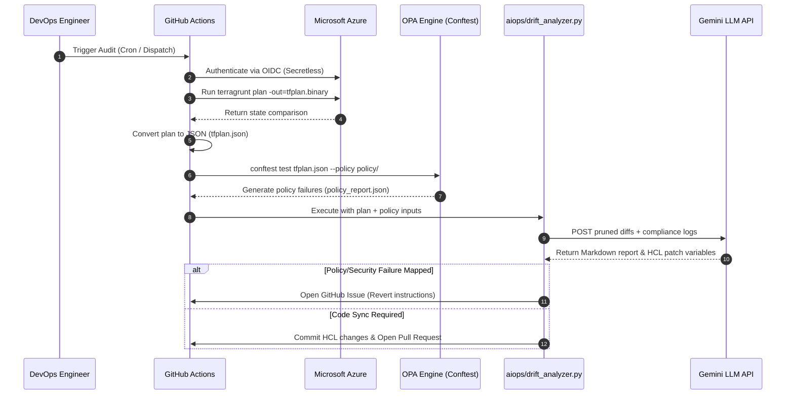

# 🤖 AI-Driven Operations (AIOps): Drift Detection & Compliance Engine

This document provides a deep dive into the architecture, design, and operations of the **AI IaC Drift Remediation Engine** implemented in this repository. 

---

## 📖 Operational Philosophy

Traditional Infrastructure as Code (IaC) pipelines are excellent at deploying static architectures. However, once infrastructure is live, it is subject to **configuration drift**—untracked manual modifications made directly via cloud consoles or CLIs.

We solve this problem by combining three modern DevOps pillars into an automated feedback loop:
1. **State Auditing**: Detecting live resources that differ from git configurations via Terragrunt/Terraform.
2. **Policy-as-Code Enforcment**: Validating those changes against strict compliance parameters defined in Open Policy Agent (OPA) policies.
3. **Large Language Models (LLMs)**: Employing the Gemini API to act as an automated SecOps Engineer—interpreting differences, mapping risks, and writing remediation scripts.

---

## 🏗️ Technical Architecture & Data Flow

The operations pipeline runs automatically via scheduled automation (GitHub Actions) or manually for pre-deployment reviews.



---

## 🛡️ OPA & compliance Integration

The drift detector doesn't just look for *any* change—it focuses heavily on **governance violations**. When a drift is detected, it is cross-referenced with your rules in `policy/infra_policies.rego`.

For example, if a developer manually alters a SQL Server firewall setting:
1. **The Drift**: `public_network_access_enabled: false` ➔ `true`.
2. **The Policy Violation**: OPA Rule #3 fails: `SQL Server must use private endpoints. Public access is disabled.`
3. **AI Interpretation**: The Gemini model correlates these inputs and reports:
   - **Risk Level**: 🔴 Critical
   - **Technical Explanation**: Explains that enabling public access bypasses private links, exposing database ports to direct internet routing.
   - **Actionable Revert**: Produces the exact CLI script (`az sql server update ...`) to disable public access.

---

## 💻 Local Pre-Deployment Auditing

Developers can run this pipeline locally to audit their code configurations or verify manual changes before submitting pull requests.

### Prerequisite: Set Gemini API Key
Generate an API key from Google AI Studio and configure your terminal environment:
* **PowerShell**: `$env:GEMINI_API_KEY="your-api-key"`
* **Bash/Linux**: `export GEMINI_API_KEY="your-api-key"`

### Step 1: Run the Plan
Run Terragrunt and export the comparison output to JSON:
```bash
cd environments/dev
terragrunt run-all plan -out=tfplan.binary
terragrunt show -json tfplan.binary > tfplan.json
```

### Step 2: Evaluate OPA Policies
Validate the plan against the OPA rules folder and output the results to JSON:
```bash
conftest test tfplan.json --policy ../../policy/ --output json > policy_report.json
```

### Step 3: Run the AI Analyzer
Invoke the Python script to produce a local audit review report:
```bash
python ../../aiops/drift_analyzer.py \
  --plan tfplan.json \
  --policy-report policy_report.json \
  --output my_audit_report.md
```
Open `my_audit_report.md` to see the complete SecOps evaluation.

---

## 🚀 Production Pipeline Guidelines

For active enterprise environments, the system runs inside [.github/workflows/drift-detector.yml](file:///C:/Users/shrey/OneDrive/Documents/Repos/tf-azure/.github/workflows/drift-detector.yml) and relies on these best practices:

### 1. Secretless Authentication (Azure OIDC)
The live workflow utilizes **OpenID Connect (OIDC)** to federate GitHub Actions with your Azure Active Directory tenant. This avoids the need to store long-lived service principal client secrets in GitHub. 
Ensure the following variables are configured in repository secrets:
- `AZURE_CLIENT_ID`
- `AZURE_TENANT_ID`
- `AZURE_SUBSCRIPTION_ID`

### 2. Triage Workflows
When drift is detected, the operations team should follow these guidelines to resolve it:
* **Option A: Revert (Recommended for Security Breaches)**
  - Open the generated GitHub Issue.
  - Review the AI-generated Azure CLI command under the **Revert Action** section.
  - Copy and run the command in your cloud console/terminal to restore alignment with Git.
* **Option B: Adopt (Recommended for Planned Scaling/Upgrades)**
  - Find the automated Pull Request opened by the bot (labeled `drift-adoption`).
  - Review the proposed variables updates.
  - Merge the PR to adopt the live changes back into your Git repository.
