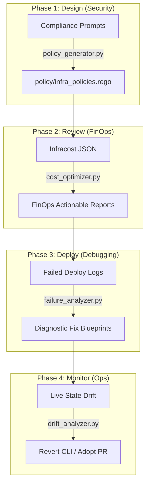

# 🤖 AI-Driven Operations (AIOps): The Closed-Loop IaC Lifecycle

This document provides a deep dive into the architecture, design, and operations of the **AIOps Lifecycle Suite** implemented in this repository. 

---

## 📖 Operational Philosophy

Traditional Infrastructure as Code (IaC) loops are passive—they deploy static configurations but require heavy manual intervention when things go wrong, when costs spike, or when configuration drift occurs.

To build an enterprise-ready pipeline, this repository integrates a **closed-loop AI Operations Lifecycle** that actively assists engineers across four critical phases:
1. **Compliance Policy Generation (Design Phase)**: Translates security compliance guidelines into OPA rules.
2. **FinOps Cost Optimization (Review Phase)**: Analyzes Infracost differentials and proposes capacity scaling cost-cutting patches.
3. **Deployment Failure Diagnostics (Debugging Phase)**: Ingests API trace errors and generates resolutions.
4. **Drift Remediation (Monitoring Phase)**: Audits live resources against Git configurations and writes revert/adoption code.

---

## 🏗️ Lifecycle Data Flow



---

## 🛠️ The AIOps Tool Suite

All AI helper scripts reside in the top-level **[aiops/](file:///C:/Users/shrey/OneDrive/Documents/Repos/tf-azure/aiops/)** directory and are built using Python's standard libraries to run out-of-the-box without external pip packages:

### 1. Drift Analyzer (`aiops/drift_analyzer.py`)
* **Objective**: Analyzes Terraform plan diff JSONs and OPA test reports to output plain-English reviews.
* **Outputs**: Generates a warning report detailing resource changes, associated policy failures, and dual-remediation actions:
  * **Revert**: Azure CLI commands to restore cloud configurations.
  * **Adopt**: HCL code blocks to synchronize variables back into Git.

### 2. FinOps Cost Optimizer (`aiops/cost_optimizer.py`)
* **Objective**: Analyzes Infracost monthly cost variations on pull requests.
* **Outputs**: Generates resource cost increases and advises on optimization practices for dev/non-production environments (e.g. downgrading to burstable VMs or disabling SQL Zone Redundancy), providing variables diffs.

### 3. Deploy Failure Analyzer (`aiops/failure_analyzer.py`)
* **Objective**: Automatically runs if a deployment/plan fails in CI/CD, parsing raw error log streams.
* **Outputs**: Translates cryptic cloud API failures (e.g., OIDC auth issues, Key Vault locks, Azure regional CPU quota limits) into readable diagnostics and creates immediate resolution commands.

### 4. OPA Policy Generator (`aiops/policy_generator.py`)
* **Objective**: Helps security engineers onboard new rules without needing to write OPA Rego code manually.
* **Outputs**: Reads existing rego files to match style imports, and generates compliant OPA Rego deny rule blocks based on plain-English requests.

---

## 💻 Running Local Demos & Pre-Deployment Auditing

Set up your Gemini API Key in your terminal:
* **PowerShell**: `$env:GEMINI_API_KEY="your-key-here"`
* **Bash/Linux**: `export GEMINI_API_KEY="your-key-here"`

### Run local dry-runs on mock data (No Azure account required):
```bash
# 1. Test Drift Detection
python aiops/drift_analyzer.py --demo

# 2. Test Cost Optimization
python aiops/cost_optimizer.py --demo

# 3. Test Failure Diagnostics
python aiops/failure_analyzer.py --demo

# 4. Test OPA Policy Generation
python aiops/policy_generator.py --prompt "Ensure Storage Account HTTPS traffic only" --demo
```

---

## 🚀 CI/CD Pipeline Integrations

The AIOps suite is integrated into your GitHub Action pipelines:

1. **Pull Requests (`terragrunt.yml`)**:
   - Executes `cost_optimizer.py` on Infracost JSON outputs, posting FinOps review summaries as comments directly on the PR.
   - If the Plan stage encounters errors, triggers `failure_analyzer.py` on the output log and prints the troubleshooting recommendations as a PR comment.
2. **Nightly Audits (`aiops-live-audit.yml`)**:
   - Performs a daily live state comparison against Azure using secretless OIDC authentication.
   - Converts the plan to JSON, executes OPA validation, and uses `drift_analyzer.py` to:
     * Open a **GitHub Issue** detailing policy violations and revert commands.
     * Open an automated **Adoption PR** containing the variables changes.
3. **Operational Sandbox (`aiops-suite-demo.yml`)**:
   - An offline demo workflow that runs all four tools in dry-run/mock mode, compiling and rendering all Markdown reports directly to the **GitHub Actions Job Summary** dashboard.
