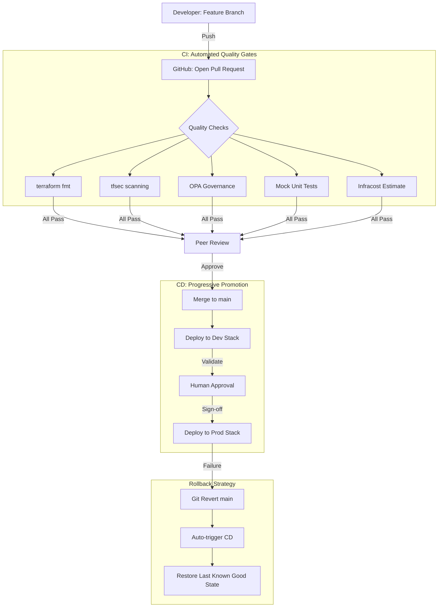

# GitOps & Development Workflow

This project follows a **GitOps** methodology, treating the git repository as the single source of truth for the entire Azure infrastructure and Kubernetes configuration.

## 1. Professional DevOps Workflow

The following diagram visualizes the end-to-end lifecycle of a change in this repository, from feature development to production deployment.

## 2. Kubernetes-Native GitOps

With the integration of **Azure Kubernetes Service (AKS)**, our workflow extends into the application layer:

### Workload Identity Pattern
We utilize **Azure AD Workload Identity**. Instead of storing service principal keys in Kubernetes secrets, pods are associated with an Azure User-Assigned Managed Identity via a Kubernetes Service Account. This enables secretless access to Azure resources (like Key Vault or SQL).

### Secret Management (CSI Driver)
We implement the **Azure Key Vault Secrets Store CSI Driver**. Secrets are authored in Key Vault and "mounted" as volumes in the Kubernetes pods.
- **Workflow:** Secret Updated in KV -> Automatically synced to K8s Pod -> No restart required.

### Ingress & Traffic Management
We leverage the **Application Gateway Ingress Controller (AGW)**. This creates a high-performance, L7 load balancing path directly from the public internet into the AKS cluster, managed entirely through Kubernetes Ingress resources.

## 3. Environment Promotion Strategy

We use a **Directory-Based Promotion** model supported by Terragrunt:

1. **Development:** Changes are first applied to `environments/dev`. This is where we break things and iterate.
2. **Production:** Once validated, the same module versions and configurations are promoted to `environments/prod`.
3. **Parity:** We maintain strict parity between environments, differing only in **Scale** (node counts) and **Resiliency** (zone redundancy).

## 4. Rollback Strategy

1. **Infrastructure Level:** If a Terragrunt apply fails or causes a regression, we perform a `git revert` on the `main` branch. The CI/CD pipeline triggers an automated "roll-forward" to the previous stable state.
2. **State Level:** Since we have **State Versioning** enabled (see [State Management](./state-management.md)), we can manually restore a previous version of the `.tfstate` blob if corruption occurs.
3. **Kubernetes Level:** We use Helm's native rollback capabilities (`helm rollback`) or GitOps controllers (like ArgoCD/Flux) to instantly revert application-level deployments.
