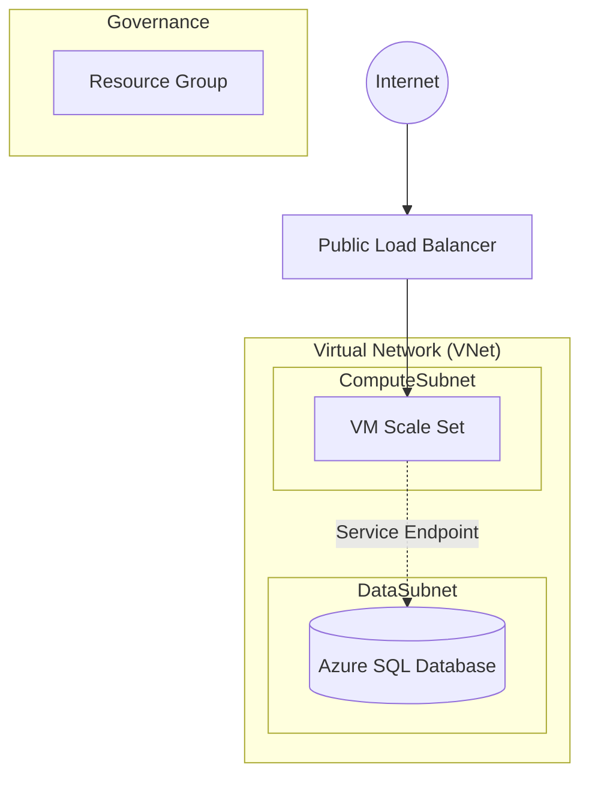

# Complete Enterprise Architecture Example (Terragrunt Stacks)

> [!CAUTION]
> **🚨 MASSIVE DESTROY WARNING 🚨**
> This example deploys production-grade resources. Depending on your active profile (`dev.hcl` or `prod.hcl`), this can cost between **$50 - $500 per month**. 
> **YOU MUST RUN `terragrunt run-all destroy`** immediately after your testing to avoid significant Azure charges.

---

This example demonstrates how to orchestrate multiple infrastructure modules using **Terragrunt Stacks** to build a professional, multi-layered Azure environment.

## 🏗️ Architecture



## 🌟 Key Features
- **Grouped Stacks:** Clean separation of Foundation, Networking, Compute, and Database concerns.
- **Environment Toggling:** Switch between `dev.hcl` and `prod.hcl` to see how the architecture scales.
- **Auto-Scaling:** The VMSS is configured to automatically scale based on load.
- **Service Endpoints:** Secure, backbone-only routing from the Compute tier to the Database tier.
- **Live Web Demo:** Automatically installs NGINX and serves a custom landing page.

## 🚀 Deployment Instructions

### 1. Prerequisites
- [Terraform CLI](https://developer.hashicorp.com/terraform/downloads) (v1.5.0+) or OpenTofu.
- [Terragrunt CLI](https://terragrunt.gruntwork.io/) (v0.50.0+).
- [Azure CLI](https://docs.microsoft.com/en-us/cli/azure/install-azure-cli) installed and authenticated (`az login`).

### 2. Step-by-Step Deployment

1. **Clone the Repo & Navigate:**
   ```bash
   cd examples/complete-enterprise-architecture
   ```

2. **(Optional) Switch to Production Profile:**
   By default, the example uses `dev.hcl`. To switch to high-availability production:
   ```bash
   cp prod.hcl env.hcl
   ```

3. **Initialize & Deploy All Stacks:**
   Terragrunt will automatically calculate the dependencies (Foundation -> Networking -> Compute/DB) and deploy them in order.
   ```bash
   terragrunt run-all apply
   ```

4. **Verify the Deployment:**
   - **Resource Location:** All resources are created in a Resource Group named after your active profile's `project_prefix`.
     - **Dev:** `tfaz-demo-dev-rg`
     - **Prod:** `tfaz-demo-prod-rg`
   - **Webpage:** Find the **Load Balancer Public IP** in the portal (named `${prefix}-vmss-lb-pip`).
   - Open your browser and navigate to that IP address to see the NGINX landing page.

## 💰 Cost Estimation (Infracost)

| Profile | Key Components | Monthly Est. |
|---------|----------------|--------------|
| **Dev** | Standard_B1s, Basic SQL | **~$50** |
| **Prod** | Standard_DS1_v2 (3 nodes), S0 SQL | **~$450** |

## 🛠️ Cleanup

To avoid being billed by Azure, you **must** destroy the resources:

```bash
terragrunt run-all destroy
```
