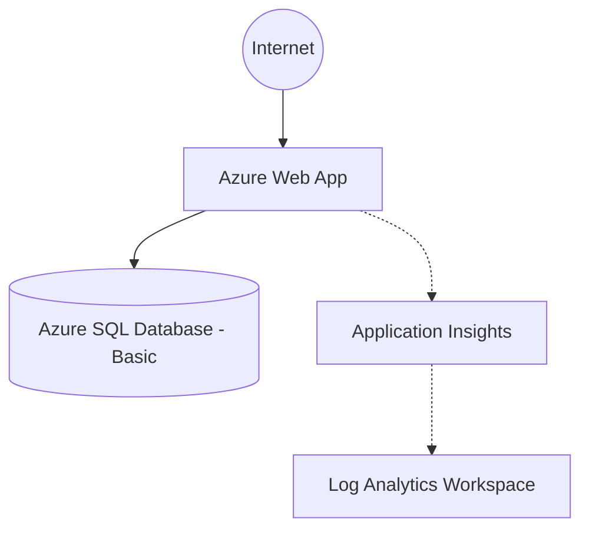

# Simple Serverless App Example

This example demonstrates a cost-optimized, Platform-as-a-Service (PaaS) deployment. It is ideal for lightweight applications, proofs of concept, or learning environments.

## 🏗️ Architecture



This deployment provisions:
- An Azure App Service Plan (B1 Burstable tier).
- An Azure Web App for hosting the application code.
- An Azure SQL Database on the Basic tier (cost-optimized).
- Application Insights and Log Analytics for integrated telemetry and monitoring.

## 🚀 Deployment Instructions

### Prerequisites
- [Terraform CLI](https://developer.hashicorp.com/terraform/downloads) installed (v1.5.0+ or OpenTofu 1.6+).
- [Azure CLI](https://docs.microsoft.com/en-us/cli/azure/install-azure-cli) installed and authenticated (`az login`).

### Step-by-Step

1. **Prepare Variables:**
   Copy the sample variables file and populate it with a strong SQL password.
   ```bash
   cp terraform.tfvars.sample terraform.tfvars
   ```

2. **Initialize Terraform:**
   Downloads required providers and initializes the local state.
   ```bash
   terraform init
   ```

3. **Deploy:**
   Review the planned changes and apply them to your Azure subscription.
   ```bash
   terraform apply
   ```

## 💰 Cost Estimation

This architecture is deliberately designed to be **Cost-Optimized**. 
Using `infracost`, the estimated monthly cost for this deployment is roughly **~$15 - $25/month**, primarily depending on log ingestion volume.

### Cleanup

To destroy the infrastructure and stop incurring charges:

```bash
terraform destroy
```
